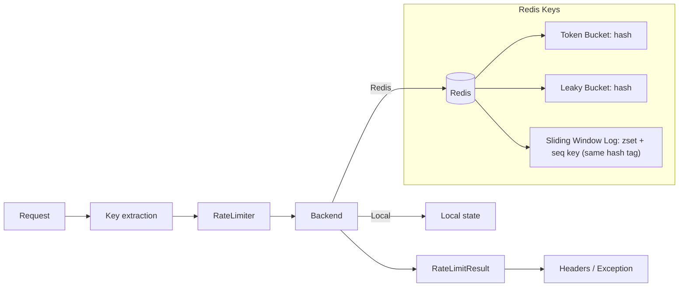

# Architecture

This document summarizes request flow, backend storage layout, and operational
notes for production use.

## Data Flow

1. **Request** enters the application.
2. **Key extraction** maps the request to a rate-limit key.
3. **RateLimiter** forwards the key to the configured backend.
4. **Backend** loads current state and runs the algorithm:
   - Local: in-memory state + monotonic clock
   - Redis: Lua script + Redis server time
5. **Storage mutation** writes updated state (local dict or Redis).
6. **Result** is returned with metadata (`remaining`, `retry_after`, `reset_at`).
7. **Integration** attaches headers or raises `HTTPException`/`RateLimitExceeded`.

## Architecture Diagram

## Redis Storage Layout

### Token Bucket

- **Type**: Redis hash
- **Fields**: `tokens`, `last_refill`
- **TTL**: `ceil(burst_size / tokens_per_second)`

### Leaky Bucket

- **Type**: Redis hash
- **Fields**: `queue_size`, `last_leak`
- **TTL**: `ceil(capacity / leak_rate)`

### Sliding Window Log

- **Type**: Redis sorted set
- **Members**: `timestamp_ms:sequence`
- **TTL**: `ceil(period_seconds)`
- **Aux key**: `{key}:seq` for uniqueness, same TTL as the window
- **Cluster note**: window and sequence keys must share the same Redis hash tag

## Local Backend Retention

- Entries store `expires_at` (monotonic time).
- Periodic cleanup runs every `cleanup_interval` seconds.
- TTL matches Redis behavior per algorithm to keep parity and bounded memory.

## Operational Notes

- **Persistence**: Redis persistence affects durability of counters after restarts.
- **Cardinality**: key count drives memory. Sliding window uses O(N) memory per key.
- **Multi-instance**: use Redis backend for shared limits across instances.
- **Clocking**: local backend uses a monotonic clock; Redis uses server time.
- **Redis Cluster**: Sliding Window Log touches two keys (`<key>` and `<key>:seq`). Ensure both include the same hash tag (e.g., `rate:{user}:window` and `rate:{user}:window:seq`).
